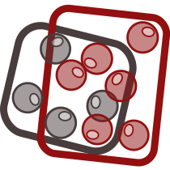
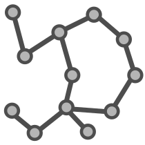

```{css, echo=FALSE}
.darker-code {
  color: #2f2f2f;
}
```

```{r, include = FALSE}
knitr::opts_chunk$set(
  collapse = FALSE,
  results = "hold",
  message = FALSE,
  class.source  = "darker-code"
)
```

# Introduction

SeuratIntegrate is an R package that aims to extend the pool of single-cell RNA
sequencing (scRNA-seq) integration methods available in
[Seurat](https://satijalab.org/seurat/). Moreover, SeuratIntegrate provides a
set of tools to evaluate the performance of the integrations produced.

## Integrations

SeuratIntegrate provides access to R and Python methods to correct batch effect:

| Method | Type | Implementation | Underlying algorithm | Reference |
|:-------|:------:|:-------------:|:-------------:|--------------:|
| ComBat | {width="40"} | [sva](https://doi.org/doi:10.18129/B9.bioc.sva) (Bioconductor) | Empirical Bayes adjustment | [Johnson et al., 2007](https://doi.org/10.1093/biostatistics/kxj037) |
| Harmony | {width="40"} | [harmony](https://cran.r-project.org/package=harmony) (CRAN) | Iterative embedding correction | [Korsunsky et al., 2019](https://doi.org/10.1038/s41592-019-0619-0) |
| MNN | {width="40"} | [batchelor](https://doi.org/doi:10.18129/B9.bioc.batchelor) (Bioconductor) | Mutual Nearest Neighbors | [Haghverdi et al., 2018](https://doi.org/10.1038/nbt.4091) |
| BBKNN | {width="40"} | [bbknn](https://github.com/Teichlab/bbknn) (GitHub) | Batch-balanced nearest neighbors | [Polański et al., 2020](https://doi.org/10.1093/bioinformatics/btz625) |
| scVI | {width="40"} | [scvi-tools](https://github.com/scverse/scvi-tools) (GitHub) | Variational autoencoder | [Lopez et al., 2018](https://doi.org/10.1038/s41592-018-0229-2) |
| scANVI | {width="40"} | [scvi-tools](https://github.com/scverse/scvi-tools) (GitHub) | Semi-supervised variational autoencoder | [Xu et al., 2021](https://doi.org/10.15252/msb.20209620) |
| Scanorama | {width="40"} | [scanorama](https://github.com/brianhie/scanorama) (GitHub) | Manifold alignment | [Hie et al., 2019](https://doi.org/10.1038/s41587-019-0113-3) |
| trVAE | {width="40"} | [scArches](https://github.com/theislab/scarches) (GitHub) | Conditional variational autoencoder | [Lotfollahi et al., 2020](https://doi.org/10.1093/bioinformatics/btaa800) |

: Comprehensive overview of the integration methods provided by SeuratIntegrate

SeuratIntegrate provides a new interface to integrate the layers of an object:
`DoIntegrate()`. Moreover, SeuratIntegrate is compatible with `CCA` and `RPCA`
(included in [Seurat](https://satijalab.org/seurat/)) and `FastMNN` (from
[SeuratWrappers](https://github.com/satijalab/seurat-wrappers))

## Scoring

SeuratIntegrate incorporates 11 scoring metrics: 6 quantify the degree of batch
mixing {width="30"}
(*batch correction*), while 5 assess the preservation of biological differences
{width="30"}
(*bio-conservation*) based on ground truth cell type labels.

Below is a table summarising each score's input and type:

| Score name | Require a cell type variable | Require a clustering variable | Input | Score type |
|:--------------|:-------------:|:-------------:|:-------------:|--------------:|
| Cell cycle regression |  |  | {width="60"} | {width="60"} |
| PCA regression |  |  | {width="60"} | {width="60"} |
| PCA density |  |  | {width="60"} | {width="60"} |
| ASW batch |  |  | {width="60"} | {width="60"} |
| ASW |  |  | {width="60"} | {width="60"} |
| ARI |  |  |  | {width="60"} |
| NMI |  |  |  | {width="60"} |
| cLISI |  |  | {width="60"} or {width="60"} | {width="60"} |
| iLISI |  |  | {width="60"} or {width="60"} | {width="60"} |
| kBET |  |  | {width="60"} or {width="60"} | {width="60"} |
| Graph connectivity |  (`per.component = TRUE`) |  | {width="60"} | {width="60"} |

: Table summarising the inputs required for each score, and the type of scores
it belongs to.

Most scores are computed on an embedding
{width="30"}
(`Seurat::DimReduc` object) or a graph
{width="30"}
(`Seurat::Neighbor` or `Seurat::Graph` object). The exceptions are ARI and NMI,
which compare two categorical variables thus don't need anything else than a
cell-type and a cluster assignment variables.d anything else than a cell-type and a
cluster assignment variables.

Most scores are based on a cell type label variable. This consists in an
estimate of each cell's type obtained by analysing each batch separately or by
using an automatic cell annotation algorithm. This estimate of cell types must
be of sufficient quality to be considered suitable as ground truth.

# Setup

```{r setup, message=FALSE, warning=FALSE, results='hide'}
library(SeuratIntegrate)
```

We will use the small dataset of 200 immune liver cells and around 6,500 genes
included in SeuratIntegrate. 

```{r load-data}
data("liver_small")
```

```{r}
dim(liver_small)  # genes x cells
```

It comprises 4 donors from 2 studies. Among the donors, 2 are healthy and 2 are
suffering from a hepatocellular carcinoma (HCC).

```{r count-cells, echo=FALSE, results='asis'}
library(dplyr)
liver_small[[]] %>% group_by(First_author, ID_sample, Tissue_type) %>%
  count() %>% rmarkdown::paged_table()
```

Importantly, the Seurat object's metadata also embeds cell type annotation
variables.

```{r, eval=FALSE}
liver_small[[]][,c(13, 15:17)]
```
```{r, echo=FALSE}
liver_small[[]] %>% select(matches("cell.?type") & ! contains("score")) %>%
  rmarkdown::paged_table()
```


Note that albeit not compulsory, a **high quality cell-type annotation**
is very important to evaluate the performance of integrations because many
scoring metrics use them as ground truth. Moreover, it helps in verifying
whether technical effects (usually called batch effects) overweight true
biological differences.

Here, we use the last one and save it:

```{r}
cell.var <- "manual_cell_type_short"
```


We are going to test 3 integration methods that output different types of
objects. We will use ComBat (corrected counts), BBKNN (corrected knn graph)
and Harmony (corrected dimension reduction). BBKNN is a Python method, so we
need to have a conda environment to be able to use it. Right now, we don't have
such an environment:

```{r, eval=FALSE}
getCache()
```
```{r png-conda-unset, echo=FALSE, out.width='100%', fig.align='center'}
#| fig.alt: Unset conda environments
knitr::include_graphics('img/conda_envs_unset.png', )
```

Hopefully, SeuratIntegrate facilitates the task with `UpdateEnvCache()`:

```{r echo=FALSE}
if (! isValid(getCache()$bbknn)) {
  UpdateEnvCache("bbknn")
}
```
```{r eval=FALSE}
UpdateEnvCache("bbknn")
```

<blockquote style="font-size: 1em;">
*Note*: Similarly, you can call `UpdateEnvCache()` with all other Python methods
("scvi", "scanorama", "trVAE") to set up their corresponding conda environments.
</blockquote>

If the process is successful, the cache of conda environments should have been
updated:

```{r, eval=FALSE}
getCache()
```
```{r png-conda-bbknn, echo=FALSE, out.width='100%', fig.align='center'}
#| fig.alt: Conda environment set for BBKNN
knitr::include_graphics('img/conda_envs_bbknn.png')
```

We also want to make sure we have a conda environment with a umap-learn version
compatible with Seurat:

```{r, echo=FALSE}
if (! reticulate::condaenv_exists('umap_0.5.4')) {
  reticulate::conda_create('umap_0.5.4', packages = 'umap-learn=0.5.4')
}
```
```{r, eval=FALSE}
reticulate::conda_create('umap_0.5.4', packages = 'umap-learn=0.5.4')
```


# Preprocessing with Seurat

To ensure that SeuratIntegrate works well, it is indispensable to split the
Seurat object. This process distributes cells into single-batch layers such that
each batch is normalized independently. We account for potential technical
variability between samples by designating "ID_sample" as the batch variable.

```{r standard-workfow, results='hide', warning=FALSE}
batch.var <- "ID_sample"  # save for later

liver_small <- split(liver_small, f = liver_small$ID_sample)
liver_small <- SCTransform(liver_small)

liver_small <- RunPCA(liver_small)
liver_small <- FindNeighbors(liver_small, dims = 1:20, k.param = 15L)
liver_small <- RunUMAP(liver_small, dims = 1:20, n.neighbors = 15)
```


```{r, fig.height=4, fig.width=9}
#| fig.alt: >
#|   UMAP of unintegrated liver data with cells colored by first author
#|   and sample id (i.e. batch)
DimPlot(liver_small, group.by = c("First_author", "ID_sample"))
```

```{r, fig.width=5, fig.height=4}
#| fig.alt: >
#|   UMAP of unintegrated liver data with cells colored by cell type label
DimPlot(liver_small, group.by = cell.var)
```

# Integration with SeuratIntegrate


```{r integrate, warning=FALSE}
liver_small <-
  DoIntegrate(object = liver_small,
              
            # integrations
              CombatIntegration(),
              bbknnIntegration(orig = "pca", ndims.use = 20),
              SeuratIntegrate::HarmonyIntegration(orig = "pca", dims = 1:20),
              
            # additional parameters
              use.hvg = TRUE,
              use.future = c(FALSE, TRUE, FALSE)
)
```

If we take a look at our Seurat object, we can note that it has been enriched
with many objects:
```{r}
print(liver_small)
cat("\n#####\n\n")
print(Graphs(liver_small))
```

Important outputs are:

-   New assay **combat.reconstructed**
-   New reduction **harmony**
-   New graphs **bbknn_ridge.residuals_[...]**

# Post-processing

The type of output is important to consider, because scoring metrics are not
compatible with all output types. The simplest strategy is to process each
output separately in order to obtain at least a PCA out of it, or even a knn
graph (indispensable to compute clusters). Note that several scores cannot be
computed on knn graphs, hence knn graph outputs (e.g. BBKNN) can only be
evaluated by a reduced set of metrics.

Below is a summary for each output type (bracketed steps are not always necessary):

-   corrected counts: [`ScaleData()`] -> `RunPCA()` -> [`FindNeighbors()` -> `FindOptimalClusters()`]
-   Dimension reduction: [`RunPCA()`] -> [`FindNeighbors()` -> `FindOptimalClusters()`]
-   knn graph:  [`FindOptimalClusters()`]

Here, we will use `SymmetrizeKnn()` between `FindNeighbors()` and
`FindOptimalClusters()` because `return.neighbor = TRUE`. This is
useful to keep the distances between cells in the `KNN` graph. Although not
compulsory, this is used to stay in line with BBKNN's output. To prevent the
community detection algorithm to output a high fraction of singletons, we
"*symmetrize*" the matrix which makes the graph "undirected".

```{r prepare-combat, warning=FALSE}
# corrected counts outputs
DefaultAssay(liver_small) <- "combat.reconstructed"
VariableFeatures(liver_small) <- VariableFeatures(liver_small[["SCT"]])
liver_small <- ScaleData(liver_small)

liver_small <- RunPCA(liver_small, npcs = 50L, reduction.name = "pca.combat")
liver_small <- FindNeighbors(liver_small, reduction = "pca.combat", dims = 1:20,
                     return.neighbor = TRUE, graph.name = "knn.combat")
liver_small <- SymmetrizeKnn(liver_small, graph.name = "knn.combat")
liver_small <- FindOptimalClusters(liver_small, graph.name = "knn.combat_symmetric",
                           cluster.name = "combat_{cell.var}_{metric}",
                           cell.var = cell.var,
                           optimisation.metric = c("nmi", "ari")) # default, compute both

DefaultAssay(liver_small) <- "SCT"
```

```{r prepare-harmony, warning=FALSE}
# dimension reduction outputs
liver_small <- FindNeighbors(liver_small, reduction = "pca", dims = 1:20, k.param = 20L,
                     return.neighbor = TRUE, graph.name = "knn.unintegrated")
liver_small <- SymmetrizeKnn(liver_small, graph.name = "knn.unintegrated")
liver_small <- FindOptimalClusters(liver_small, graph.name = "knn.unintegrated_symmetric",
                           cluster.name = "unintegrated_{cell.var}_{metric}",
                           cell.var = cell.var)


liver_small <- FindNeighbors(liver_small, reduction = "harmony", dims = 1:20,
                     return.neighbor = TRUE, graph.name = "knn.harmony")
liver_small <- SymmetrizeKnn(liver_small, graph.name = "knn.harmony")
liver_small <- FindOptimalClusters(liver_small, graph.name = "knn.harmony_symmetric", cell.var = cell.var,
                           cluster.name = "harmony_{cell.var}_{metric}")
```

```{r prepare-bbknn, warning=FALSE}
# graph outputs
liver_small <- SymmetrizeKnn(liver_small, graph.name = "bbknn_ridge.residuals_distances")
liver_small <- FindOptimalClusters(liver_small, graph.name = "bbknn_ridge.residuals_distances_symmetric",
                           cell.var = cell.var, cluster.name = "bbknn_{cell.var}_{metric}")
```

# Scoring

Now that we have post-processed each integration's output, we can compute
multiple scores to estimate the accuracy of the integrations.

## Scores not requiring a cell type variable

Those scores are run on a dimension reduction (such as a PCA) and are not
compatible with graph outputs. They are cell-type free score thus do not require
a cell-type label variable.

```{r, warning=FALSE, results="hide"}
liver_small <- AddScoreRegressPC(liver_small, integration = "unintegrated",
                                 batch.var = batch.var, reduction = "pca")
liver_small <- AddScoreRegressPC(liver_small, integration = "combat",
                                 batch.var = batch.var, reduction = "pca.combat")
liver_small <- AddScoreRegressPC(liver_small, integration = "harmony",
                                 batch.var = batch.var, reduction = "harmony")

liver_small <- AddScoreDensityPC(liver_small, integration = "unintegrated",
                                 batch.var = batch.var, reduction = "pca")
liver_small <- AddScoreDensityPC(liver_small, integration = "combat",
                                 batch.var = batch.var, reduction = "pca.combat")
liver_small <- AddScoreRegressPC(liver_small, integration = "harmony",
                                 batch.var = batch.var, reduction = "harmony")

liver_small <- CellCycleScoringPerBatch(liver_small, batch.var = batch.var,
                                        s.features = cc.genes$s.genes,
                                        g2m.features = cc.genes$g2m.genes)
liver_small <- AddScoreRegressPC.CellCycle(liver_small, integration = "unintegrated",
                                           batch.var = batch.var, what = "pca",
                                           compute.cc = FALSE, dims.use = 1:20)
liver_small <- AddScoreRegressPC.CellCycle(liver_small, integration = "combat",
                                           batch.var = batch.var, what = "pca.combat",
                                           compute.cc = FALSE, dims.use = 1:20)
liver_small <- AddScoreRegressPC.CellCycle(liver_small, integration = "harmony",
                                           batch.var = batch.var, what = "harmony",
                                           compute.cc = FALSE, dims.use = 1:20)
```

## Scores based on silhouette width

Those scores return an average silhouette width (ASW), either per cell type
label or per batch. They are run on a dimension reduction (such as a PCA) and
are not compatible with graph outputs. They are based on a cell-type label
variable. However, `ScoreASWBatch()` can be run in a cell-type label independent
manner with `per.cell.var = FALSE`.

```{r, warning=FALSE, results="hide"}
liver_small <- AddScoreASW(liver_small, integration = "unintegrated",
                           cell.var = cell.var, what = "pca")
liver_small <- AddScoreASW(liver_small, integration = "combat",
                           cell.var = cell.var, what = "pca.combat")
liver_small <- AddScoreASW(liver_small, integration = "harmony",
                           cell.var = cell.var, what = "harmony")

liver_small <- AddScoreASWBatch(liver_small, integration = "unintegrated",
                                batch.var = batch.var, cell.var = cell.var,
                                what = "pca")
liver_small <- AddScoreASWBatch(liver_small, integration = "combat",
                                batch.var = batch.var, cell.var = cell.var,
                                what = "pca.combat")
liver_small <- AddScoreASWBatch(liver_small, integration = "harmony",
                                batch.var = batch.var, cell.var = cell.var,
                                what = "harmony")
```

## Scores working on a graph

Those scores are graph outputs. They require a cell-type label variable.

```{r, warning=FALSE, results="hide"}
liver_small <- AddScoreConnectivity(liver_small, integration = "unintegrated",
                                    graph.name = "knn.unintegrated_symmetric",
                                    cell.var = cell.var)
liver_small <- AddScoreConnectivity(liver_small, integration = "combat",
                                    graph.name = "knn.combat_symmetric",
                                    cell.var = cell.var)
liver_small <- AddScoreConnectivity(liver_small, integration = "harmony",
                                    graph.name = "knn.harmony_symmetric",
                                    cell.var = cell.var)
liver_small <- AddScoreConnectivity(liver_small, integration = "bbknn",
                                    graph.name = "bbknn_ridge.residuals_distances_symmetric",
                                    cell.var = cell.var)

liver_small <- AddScoreLISI(liver_small, integration = "unintegrated",
                            batch.var = batch.var, cell.var = cell.var,
                            reduction = "pca")
liver_small <- AddScoreLISI(liver_small, integration = "combat",
                            batch.var = batch.var, cell.var = cell.var,
                            reduction = "pca.combat")
liver_small <- AddScoreLISI(liver_small, integration = "harmony",
                            batch.var = batch.var, cell.var = cell.var,
                            reduction = "harmony")
liver_small <- AddScoreLISI(liver_small, integration = "bbknn",
                            batch.var = batch.var, cell.var = cell.var,
                            reduction = NULL,
                            graph.name = "bbknn_ridge.residuals_distances_symmetric")
```

## Scores comparing two categorical variables

Those scores compare two categorical variables. Thus, they don't need anything
else than a cell-type and a cluster assignment variables (computed during
[Post-processing] with `FindOptimalClusters()`).

```{r, warning=FALSE, results="hide"}
liver_small <- AddScoreARI(liver_small, integration = "unintegrated",
                           cell.var = cell.var,
                           clust.var = paste("unintegrated", cell.var, "ari", sep = "_"))
liver_small <- AddScoreARI(liver_small, integration = "combat",
                           cell.var = cell.var,
                           clust.var = paste("combat", cell.var, "ari", sep = "_"))
liver_small <- AddScoreARI(liver_small, integration = "harmony",
                           cell.var = cell.var,
                           clust.var = paste("harmony", cell.var, "ari", sep = "_"))
liver_small <- AddScoreARI(liver_small, integration = "bbknn",
                           cell.var = cell.var,
                           clust.var = paste("bbknn", cell.var, "ari", sep = "_"))

liver_small <- AddScoreNMI(liver_small, integration = "unintegrated",
                           cell.var = cell.var,
                           clust.var = paste("unintegrated", cell.var, "nmi", sep = "_"))
liver_small <- AddScoreNMI(liver_small, integration = "combat",
                           cell.var = cell.var,
                           clust.var = paste("combat", cell.var, "nmi", sep = "_"))
liver_small <- AddScoreNMI(liver_small, integration = "harmony",
                           cell.var = cell.var,
                           clust.var = paste("harmony", cell.var, "nmi", sep = "_"))
liver_small <- AddScoreNMI(liver_small, integration = "bbknn",
                           cell.var = cell.var,
                           clust.var = paste("bbknn", cell.var, "nmi", sep = "_"))

```

## Scaling and comparison

Now that we have obtained several scores per integration, we can  compare their
performances. First, let's scale the scores between zero and one and standardize
their direction (the closer to one, always the better). This step makes things
easier to compare and improves interpretability.

```{r}
liver_small <- ScaleScores(liver_small)
```

Now, let's plot the integrations.

```{r, fig.height=6, fig.width=9}
#| fig.alt: Dot plot to compare performance of integrations based on scores
PlotScores(liver_small)
```

We can  observe that 3 overall scores have been computed, namely batch
correction, bio-conservation and overall (the average of the last two). To
balance each score's contribution to the overall scores, a min-max rescaling is
applied on each score after scaling, stretching the original score's bounds to
zero and one.

It can be disabled to preview the original scores:

```{r, fig.height=6, fig.width=9}
#| fig.alt: Dot plot of scores without min-max rescaling
PlotScores(liver_small, rescale = FALSE)
```

We can also hide scores or integrations. For instance, "PCA.density" and
"PCA.regression" are hardly informative. Let's exclude them and see how it
affects overall scores:

```{r, fig.height=6, fig.width=8}
#| fig.alt: >
#|   Dot plot of scores without min-max rescaling, excluding non-informative
#|   scores
PlotScores(liver_small, rescale = FALSE, exclude.score = c("PCA.density", "PCA.regression"))
```

Interestingly, we obtained the same ranking of integrations as in the first
figure.

# Projecting integrations on UMAPs

It is also possible to project the cells on a UMAP computed for each
integration's output, as a complementary (visual) inspection of integration
performances.

```{r, results='hide'}
liver_small <- RunUMAP(liver_small, dims = 1:20, reduction = "pca.combat",
                       reduction.name = "umap.combat")
liver_small <- RunUMAP(liver_small, dims = 1:20, reduction = "harmony",
                       reduction.name = "umap.harmony")

library(future)
plan(multisession)
liver_small %<-% {
  reticulate::use_condaenv('umap_0.5.4')
  RunUMAP(liver_small, graph = "bbknn_ridge.residuals_connectivities",
          umap.method = "umap-learn", n.epochs = 200L,
          reduction.name = "umap.bbknn") }
liver_small
plan(sequential)
```

```{r, fig.height=4, fig.width=9}
#| fig.alt: UMAP of unintegrated data
#| fig.cap: UMAP of unintegrated data
DimPlot(liver_small, group.by = c(batch.var, cell.var), reduction = "umap")
```
```{r, fig.height=4, fig.width=9}
#| fig.alt: UMAP of ComBat integration
#| fig.cap: UMAP of ComBat integration
DimPlot(liver_small, group.by = c(batch.var, cell.var), reduction = "umap.combat")
```
```{r, fig.height=4, fig.width=9}
#| fig.alt: UMAP of BBKNN integration
#| fig.cap: UMAP of BBKNN integration
DimPlot(liver_small, group.by = c(batch.var, cell.var), reduction = "umap.bbknn")
```

<details>
  <summary>**Session info**</summary>
  ```{r, echo=FALSE}
  sessionInfo()
  ```
</details>
