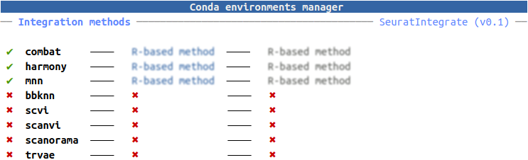
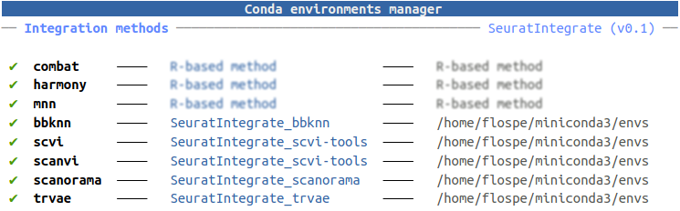

```{r, include = FALSE}
knitr::opts_chunk$set(
  collapse = TRUE,
  comment = "#>"
)
```

## Introduction

`SeuratIntegrate`'s main purpose is to extend the range of scRNA-seq integration
tools available in R and compatible with `Seurat`. Many of them being solely
available in python, we developed wrappers leveraging `reticulate` package's
capabilities. `reticulate` enables to directly call python from  R, give that
conda environments have been set up beforehand.

The purpose of this vignette is to illustrate and ease the installation and the
use of those environments.

Prior to starting, make sure you have:

- conda **installed** on your machine
- conda binary in your **`PATH`** (or that you know its location)

## Set-up

We need multiple conda environments. One for `bbknn`, one for `Scanorama`, one
for `scVI`/`scANVI` and one for `trVAE`. If you don't plan on using any or some
of these methods, whether you decide to set up their respective conda
environments is up to you.

One the contrary, if you already have some conda environments with appropriate
libraries on your machine, you can tell `SeuratIntegrate` to use them.
Let's see how.

```{r setup, message=FALSE, warning=FALSE, results='hide'}
library(SeuratIntegrate)
```

Have look at your `CondaEnvManager`:

```{r, eval=FALSE}
conda_status$current
```
```{r png-conda-unset, echo=FALSE, out.width='690px', fig.align='center'}

```

It's a handy way to have a glance at all the implemented methods and the status
of their conda environments. `ComBat`, `Harmony` and `MNN` are R-based methods
and don't need any conda environment. The rest of them however are python-based
and will function through `reticulate`, hence require conda environments.

If you don't have any conda environments for them, look at the [next sub-section](#create_env).
Conversely, if you want to add an existing conda environment, directly go to the
[following one](#use_env).

### Create new conda environments with `SeuratIntegrate` {#create_env}

**Note that the commands below have only been tested on Linux disributions**

Try the following commands (be aware that execution might take time):

```{r, eval=FALSE}
UpdateEnvCache('bbknn')
UpdateEnvCache('scvi')
UpdateEnvCache('scanorama')
UpdateEnvCache('trvae')
```

Note that:

- if conda is not in you PATH set `conda.bin = /path/to/conda`
- `scVI` and `scANVI` share the same environment. Hence, it is not necessary to
run both `UpdateEnvCache('scvi')` and `UpdateEnvCache('scanvi')`

Have look at your `CondaEnvManager`:

```{r, eval=FALSE}
conda_status$current
```
```{r png-conda-set, echo=FALSE, out.width='690px', fig.align='center'}

```

### Use existing conda environments {#use_env}

If you already have (an) existing conda environment(s) for one or more of the
methods, you can tell `SeuratIntegrate` to use it (them). Similarly, if you run
into problems with `UpdateEnvCache()`, the alternative is to set up conda
environments yourself and provide them to `SeuratIntegrate`. Whatever the case,
let's proceed.

You'll use `UpdateEnvCache()`. You can specify the name of the conda environment
or the path to it. By default, `UpdateEnvCache()` will try to decide whether the
provided value for `conda.env` is a path or a name based on simple tests. To
avoid any misinterpretation, you can use `conda.env.is.path = TRUE` or `FALSE`
when your input is the path or the name of the environment, respectively.
**But beware not to make mistakes !!!**

See examples below. You shall adapt the arguments to your situation:

```{r, eval=FALSE}
# environment for bbknn
UpdateEnvCache('bbknn', conda.env = 'bbknn_env',
               conda.env.is.path = FALSE)   # default 'auto' would work

# environment for bbknn, conda binary not in PATH
UpdateEnvCache('bbknn', conda.env = 'bbknn_env', conda.bin = 'cutom/location/conda')

# path for scvi-tools
UpdateEnvCache('scvi', conda.env = '~/miniconda3/envs/scvi-tools_env',
               conda.env.is.path = TRUE)   # default 'auto' would work
```

Note that:

- if conda is not in you PATH set `conda.bin = /path/to/conda`
- the `conda.bin` must correspond to the conda managing the `conda.env`
- `scVI` and `scANVI` share the same environment. Hence, it is not necessary to
run both `UpdateEnvCache('scvi')` and `UpdateEnvCache('scanvi')`

###  Update or reset conda environments

If you want to update a `conda` environment, use
```{r, eval=FALSE}
UpdateEnvCache(method = 'method', overwrite.env = TRUE, ...)
```

To unset an environment, use
```{r, eval=FALSE}
resetCache(method = 'method')
```


## Usage

Now you can use the python-based methods !

However, you can only load and attach one conda environment per R session. If
you plan to use multiple python-based methods, you need to launch as many
sessions as integrations using those methods. To circumvent this limitation of
reticulate, you can take advantage of the R package `future`. It allows you to
launch background R sessions, in such a way that the conda environments will be
loaded on those sessions and not on the main one. Simply follow one of the
syntaxes below (`seu` is a Seurat object, and `IntegrateLayers()` is the
function to call any integration method):

### Working on RStudio and outside

```{r, eval=FALSE}
library(future)

plan(multisession)
seu %<-% { IntegrateLayers(seu, method = bbknnIntegration) } %seed% 42L # seu is a promise
seu                                                                     # seu is evaluated
plan(multisession)
seu %<-% { IntegrateLayers(seu, method = scVIIntegration) } %seed% 42L  # seu is a promise
seu                                                                     # seu is evaluated
```

### Not working on RStudio

```{r, eval=FALSE}
library(future)

plan(multicore) # needed just once
seu %<-% { IntegrateLayers(seu, method = bbknnIntegration) } %seed% 42L # seu is a promise
seu                                                                     # seu is evaluated
seu %<-% { IntegrateLayers(seu, method = scVIIntegration) } %seed% 42L  # seu is a promise
seu                                                                     # seu is evaluated
```

### In case of failing

In practice, if an error is thrown during the evaluation, the Seurat object
would be lost and `seu` would stay a (failed) promise. To avoid this, we can use
another syntax:

```{r, eval=FALSE}
library(future)

plan(multisession) #or plan(multicore)

 f <- future({ IntegrateLayers(seu, method = bbknnIntegration) })  # f is a promise
 seu <- value(f)                                                   # f is evaluated
```

The difference comes from the fact that the promise is evaluated at the last
line. If an error is thrown, the variable `seu` is handled by R, preventing it
to be overwritten. Because it is safer, it might come in handy if you are not
familiar with integration methods from `SeuratIntegrate`.

Another error occurs when the total size of exported objects is too high.
```
Error in getGlobalsAndPackages(expr, envir = envir, globals = TRUE) : 
  The total size of the X globals that need to be exported for the future expression ('FUN()') is X GiB. This exceeds the maximum allowed size of 500.00 MiB (option 'future.globals.maxSize'). The X largest globals are ...
```
By default, `future` allows 500MB per thread. `Seurat` objects tend to grow
quickly, hence it might be necessary to increase the limit. Below is an example
to allow 1.5GB per thread:

```{r, eval=FALSE}
library(future)
ngb <- 1.5  # 1.5GB
options(future.globals.maxSize = ngb * 1e3 * 1024 ^ 2) 

plan(multisession) #or plan(multicore)
# ...
```

